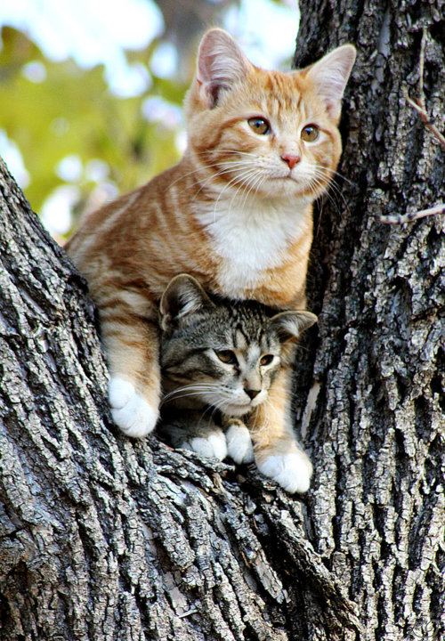

# Cat Generator

## Background

This cat generator is based on the MVC model using only raw Ruby. The generator is run on the terminal and accepts user input to generate a random cat. The user has the ability to select what action they want the cat to perform. 

The decision to use the MVC model was to keep everything cleaner and easier to read. In addition, it was more efficient to pass information. The Cat model contains the attributes and available actions of the cat. The CatView class contains what the user will see in the terminal and take the user input. Finally, the CatController class contains the flow of the generator.  

HTTParty gem was used to make the GET request to the CAT API, the Faker gem was used to generate random names and colors for the cat. 

## Setting up the Environment

1. After cloning the repo from Github, type "bundle install" in your terminal to install the necessary gems.

## Running the program

1. To start the program, type "ruby runner.rb" in your terminal. Have fun!